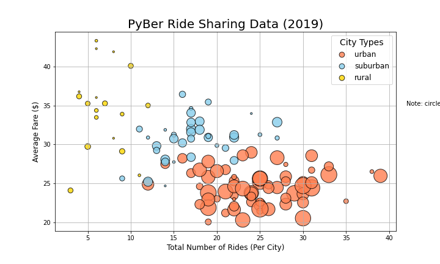
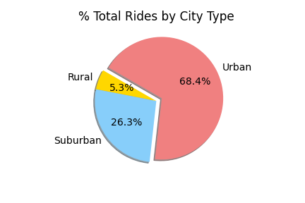
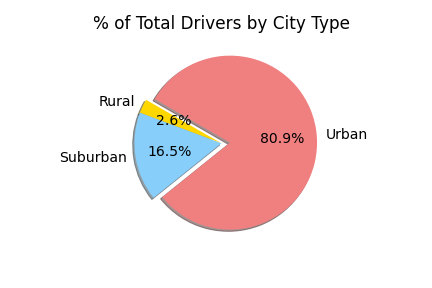
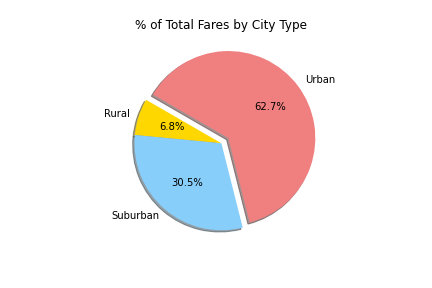
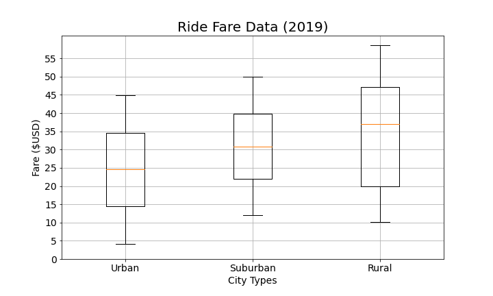
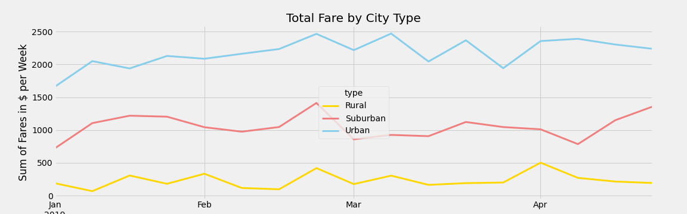

# PyBer Ride Data Analysis

This project uses python and jupyter notebook to process ride transaction data provided by the PyBer rideshare company. In this project, I use the pandas and matplotlib python modules to analyze the ride data by useful metrics thereby creating a handful of discriptive charts and dataframes that will be used to make decisions about the company's future.

---

## Results

In the raw dataset, each ride was tied to a specific city in which PyBer operates. Further, each city was classified as one of three options describing their population: Urban, Suburban, or Rural. I broke up the ride data along these classifications in order to get a feel for the differences between them as PyBer will have to focus their efforts in one place or another in order to effectively grow their business.

---

### The Data

---

---

1. Total Rides
    - For any cumulative measure pertaining to these city categories the order will always be urban then suburban then rural
    - Here is a nice breakdown of the total rides per city type as a percent of the grand total
    
    - Here it is obvious how much of Pyber's user base is located in urban areas
2. Total Drivers
    - Total drivers also follows the cumulative data schema
    
    - However it is very interesting the difference between rides and drivers
        - the average rural or suburban driver sees a much larger share of the rider base in their city than the average urban driver
3. Total Fare
    - Total fare by city is much more equal between the three types, but as a cumulative stat, it follows that urban cities would obviously dominate
    
    - I think this chart makes it abundantly clear that rural and suburban PyBer should not be discounted
4. Average Fare per Ride
    - Unlike cumulative measures, these average measures will be skewed toward rural, inversing the cumulative schema
    - The trend of higher average fare can be explained by the larger distances people must travel in these communities
    - Though, as both the box chart and bubble chart above(Fig1) will show you, there is high variance among rural fares
    
5. Total Fare by City Type
    - This graph shows the absolute fare sums by week of all three city types in a nice line chart
    
    - It shows urban cities domination of contribution to the company's bottom line
    - It also shows some interesting temporal trends including a winter decrease, and spring increase in total fares that seems consistant across city type

---

## Conclusion and Summary

I believe this analysis makes it abundantly clear that PyBer should stay focused on urban users, as they make up the vast majority of its userbase. Keep the momentum going, continue marketting and providing support to those urban cities. However, it seems that suburban users are growing and spending more than urban users at that. It might be worth a renewed effort in getting suburban drivers and riders interested in PyBer as a means of rapidly growing the income of pyber, as each new ride returns a good margin more profit in the suburbs than in the city. Lastly, I dont think the user base is large enough in rural towns to support a profit driven focus on rural cities. As the variance of per-ride fares and fickle user base cannot support an integral part of the PyBer business. However, I do think it would be useful as a marketting initiative to allocate money to provide full-time drivers as a means of providing transportation infrastructure in some small towns. A win with the media can be very powerful at a time when ride-share companies are seen less favorably among the public at large.